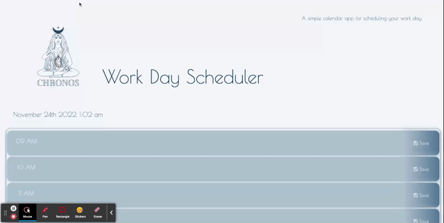

<h1 align="center"> Chronos </h1>

<p align="center">
    
  <br>
  <i>Work-Day planner
    <br> built using JavaScript.</i>
  <br>
</p>

<p align="center">
  <a href="https://larigens.github.io/chronos/"><strong>Visit us!</strong></a>
  <br>
</p>


---
## Description

Chronos is the ultimate time management tool. Be the greek god of your time, and master the time management skill.

This Work Day Scheduler is ideal for employees who want to get maximum productivity by managing daily events and keeping track of tasks. This scheduling tool allows users to track their work schedule, including meetings and personal commitments, as well as view upcoming deadlines.

## Table of Contents
- [Description](#description)
- [Table of Contents](#table-of-contents)
- [Installation](#installation)
  - [Cloning the Repository](#cloning-the-repository)
- [Mock-Up](#mock-up)
- [Usage](#usage)
- [Questions](#questions)
- [Contributions](#contributions)
  - [Contributing Guidelines](#contributing-guidelines)
  - [Code of Conduct](#code-of-conduct)
- [Credits](#credits)
  - [Acknowledgements](#acknowledgements)
  - [Links](#links)
- [License](#license)

## Installation

If you would like to understand more about the code behind the app and edit it:

### Cloning the Repository

Click `<> code` - the green button. After clicking, in the local tab, copy the SSH key. Open the terminal in your Macbook or [git bash](https://git-scm.com/downloads), if you have Windows/Linux, and type:

```bash
git clone [paste ssh key]
```

I would recommend downloading [Visual Studio Code](https://code.visualstudio.com/download) to edit the code locally. If you need more information on how to clone a repository, [click here](https://docs.github.com/en/repositories/creating-and-managing-repositories/cloning-a-repository)!
### Prerequisites

## Mock-Up

The following gif shows the web application's appearance and functionality:



## Usage

This application allows you to easily and quickly organize your daily events by the hour they occur. Each line will be color coded to indicate whether it is in the past, present, or future. To create an event on your daily planner, all you need to do is enter your plan for that hour and click the "Save" button to ensure that it will store the data. 

## Questions

For questions and support feel free to contact me via:

<a href="mailto:larigens@gmail.com">📧 Email </a> 
<a href="https://github.com/larigens">🐈‍⬛ GitHub </a>

## Contributions

### Contributing Guidelines

Want to report a bug, contribute some code, request a new feature, or improve the documentation? You can submit an issue and I will gladly welcome you as a contributor, but before submitting an issue, please search the issue tracker, as it may already exist!

### Code of Conduct

Our Code of Conduct follows the same principles as the [Contributor Covenant](https://www.contributor-covenant.org/version/2/1/code_of_conduct/), version 2.1.

## Credits

### Acknowledgements

- [W3 Schools](https://www.w3schools.com)

- [MDN](https://developer.mozilla.org/en-US/)
  
- [JQuery](https://api.jquery.com/)

- [Boostrap](https://getbootstrap.com/docs/5.2/getting-started/introduction/)
  
- [Day.js](https://day.js.org/docs/en/display/format)

### Links

[](https://larigens.github.io/lari-gui/)
[](https://www.linkedin.com/in/lari-gui/)
[](https://twitter.com/coffeebr_eak)

## License

Please refer to the [LICENSE](https://choosealicense.com/licenses/apache-2.0/) in the repo.
